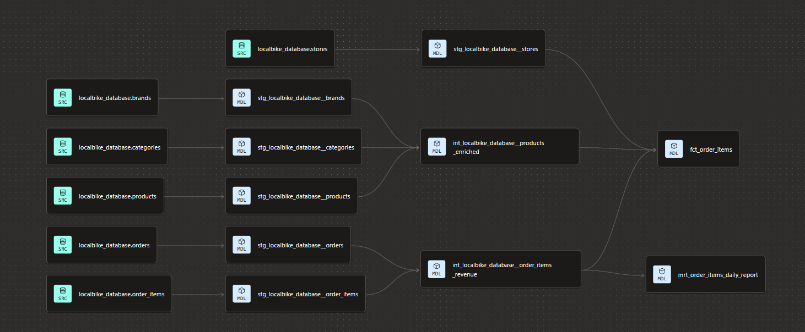
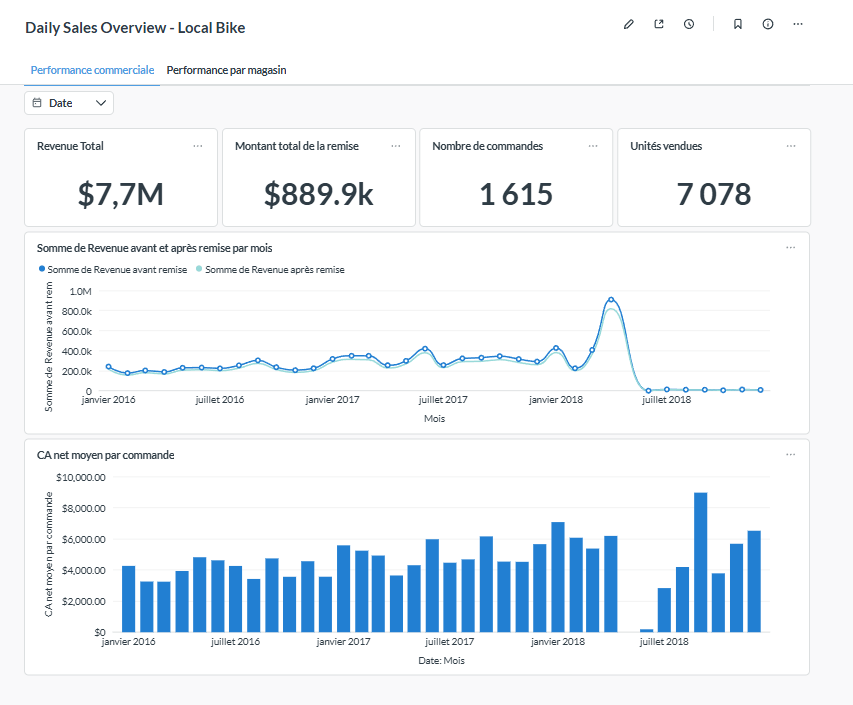
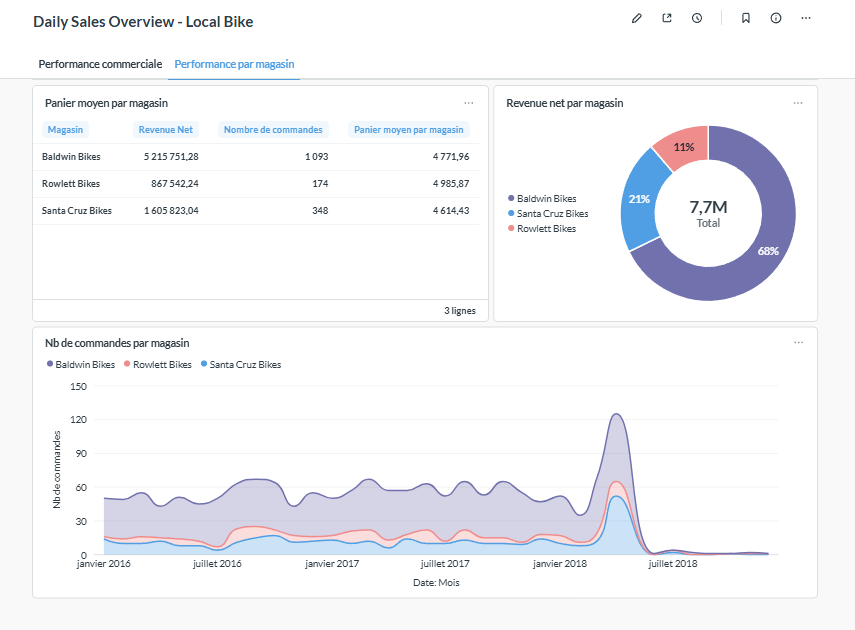

# Sales Analytics dbt Project

End-to-end dbt + BigQuery analytics engineering project on retail sales data — staging to marts modeling, tests, documentation, and a revenue-focused reporting layer, with CI/CD via GitHub Actions and dbt Cloud.

## Context

This project simulates the analytics needs of a small multi-store bike retailer operating three physical locations across the US. The company wants to move toward a data-driven approach to support its operations team, with the goal of optimizing sales performance and maximizing revenue.

As the Analytics Engineer on this project, the mission was to model the raw sales and inventory data into a clean, tested, and documented dbt project — ready to power a BI dashboard.

### Analysis axes

Three analysis axes were prioritized to directly support the revenue optimization goal:

1. **Overall sales performance** — revenue trends over time, average order value, discount impact.
2. **Store performance** — revenue and order volume comparison across the three store locations.
3. **Product performance** — revenue and sales volume by product, category, and brand.

Additional axes (inventory management, staff performance, customer analysis, order fulfillment) were identified but are out of scope for this first iteration.

## Tech stack

| Layer | Tool |
|---|---|
| Data warehouse | Google BigQuery |
| Transformation | dbt Cloud (Fusion engine) |
| Orchestration / CI | GitHub Actions + dbt Cloud CI jobs |
| Version control | Git / GitHub |
| BI / Visualization | Metabase |

### Environments

The project uses three separate dbt Cloud environments to keep concerns isolated:

| Environment | Type | Purpose |
|---|---|---|
| Development | Development | Personal dev workspace (dbt Cloud IDE) |
| CI | Deployment | Automated build/test on pull requests |
| Production | Deployment | Source of truth for BI dashboards |

### Schemas (Production)

| Schema | Content |
|---|---|
| `staging_localbike` | Cleaned and typed source tables |
| `intermediate_localbike` | Reusable business logic (revenue calculations, enriched products) |
| `marts_localbike` | Final models exposed to Metabase (`fct_order_items`, `mrt_order_items_daily_report`) |

## Data pipeline

The project follows the standard dbt layered approach: **staging → intermediate → marts**.

| Layer | Models | Purpose |
|---|---|---|
| **Staging** | `stg_localbike_database__*` (9 models) | 1:1 with source tables — renaming, type casting, light cleaning. No business logic. |
| **Intermediate** | `int_localbike_database__order_items_revenue`, `int_localbike_database__products_enriched` | Reusable business logic: revenue calculations, product/brand/category enrichment. |
| **Marts** | `fct_order_items`, `mrt_order_items_daily_report` | Final, denormalized, BI-ready models. |

### Design choices

- All monetary fields (`list_price`, `discount`) are cast to `NUMERIC` rather than relying on BigQuery's auto-detected `FLOAT64`, to avoid floating-point rounding errors on revenue calculations.
- Order line items use a surrogate key (`order_item_id`, concatenation of `order_id` and `item_id`) since the source table has no single-column primary key.
- `fct_order_items` intentionally denormalizes store and product attributes (rather than exposing separate dimension tables) to keep the model simple for self-service BI use — no joins required from the analyst's side.
- `mrt_order_items_daily_report` pre-aggregates key metrics at the daily grain to keep dashboard trend charts lightweight.

## Models

### Staging

| Model | Description |
|---|---|
| `stg_localbike_database__brands` | Bike brands. |
| `stg_localbike_database__categories` | Product categories. |
| `stg_localbike_database__customers` | Customer master data. |
| `stg_localbike_database__orders` | Customer orders (status, dates, store, staff). |
| `stg_localbike_database__order_items` | Order line items, with surrogate key. |
| `stg_localbike_database__products` | Product catalog (price, model year, brand, category). |
| `stg_localbike_database__staffs` | Employee data, including manager hierarchy. |
| `stg_localbike_database__stocks` | Inventory levels per store/product, with surrogate key. |
| `stg_localbike_database__stores` | Store locations. |

### Intermediate

| Model | Description |
|---|---|
| `int_localbike_database__order_items_revenue` | Order items enriched with order-level attributes and revenue calculations (gross revenue, net revenue, discount amount). |
| `int_localbike_database__products_enriched` | Products enriched with brand and category names. |

### Marts

| Model | Grain | Description |
|---|---|---|
| `fct_order_items` | One row per order line item | Fact table combining revenue, product, and store details. Main model for self-service BI exploration. |
| `mrt_order_items_daily_report` | One row per day | Daily aggregated revenue report (gross/net revenue, discount, units sold, orders, average order value). |

## Testing & documentation

Every model is documented (model- and column-level descriptions) and covered by data tests, including:
- `not_null` and `unique` on primary/surrogate keys
- `relationships` tests to enforce referential integrity between staging models
- `accepted_values` on categorical fields (e.g. `order_status`, `active`)

Run `dbt build` to execute the full pipeline with tests, or `dbt test` to run tests only.

## CI/CD

This project uses a two-layer CI/CD setup: dbt Cloud handles the actual build/test execution, while a GitHub Actions workflow (`.github/workflows/dbt_ci.yml`) triggers it and reports the result directly on pull requests.

### How it works

1. A pull request is opened or updated against `main`.
2. GitHub Actions calls the dbt Cloud API to trigger a dedicated CI job.
3. The CI job runs `dbt build --select state:modified+` in an isolated dbt Cloud environment (`CI`), writing to an isolated BigQuery schema — separate from the `Production` environment used by the BI dashboard.
4. The job compares changes against the `Production` environment (deferral), so only modified models — and their downstream dependencies — are rebuilt and tested, rather than the entire project.
5. GitHub Actions polls the dbt Cloud API every 15 seconds (up to ~20 minutes) until the run reaches a final status, and fails the check if the run did not succeed.
6. The dbt Cloud run URL is printed in the workflow logs for quick access to detailed results.

### Why trigger dbt Cloud instead of running dbt directly in GitHub Actions

dbt Cloud manages authentication, environments, and job configuration centrally. Rather than duplicating that setup as BigQuery credentials and a `profiles.yml` inside the GitHub Actions runner, the workflow simply triggers the job that already exists in dbt Cloud and reports its result back to the PR — keeping credentials and environment configuration in a single place.

### Environments

| Environment | Purpose |
|---|---|
| `Development` | Personal dbt Cloud IDE workspace |
| `CI` | Isolated build/test on every pull request |
| `Production` | Source of truth for the BI dashboard, deferral target for CI |

### Secrets

The workflow relies on three repository secrets, never exposed in the codebase:

| Secret | Purpose |
|---|---|
| `DBT_CLOUD_ACCOUNT_ID` | dbt Cloud account identifier |
| `DBT_CLOUD_JOB_ID` | Identifier of the CI job to trigger |
| `DBT_CLOUD_API_TOKEN` | Service token used to authenticate against the dbt Cloud API |

## Dashboard

A two-page Metabase dashboard, built on top of `fct_order_items` and `mrt_order_items_daily_report`, covering the three analysis axes.

### Overall sales performance

- **Total revenue**: $7.7M, with $889.9k in discounts applied across 1,615 orders and 7,078 units sold.
- Monthly gross vs. net revenue trend, showing the impact of discounts over time.
- Average net revenue per order, trending upward over the period.

> **Note**: the dataset is effectively concentrated between January 2016 and April 2018 — later months contain only a handful of residual orders, which explains the sharp drop visible at the end of the trend charts. This is a data coverage artifact, not an actual business decline.

### Store performance

- **Baldwin Bikes** drives the majority of revenue (68%, $5.2M), well ahead of Santa Cruz Bikes (21%) and Rowlett Bikes (11%).
- Baldwin also has the highest order volume (1,093 orders) but a comparable average order value to the other two stores (~$4,600–$5,000), suggesting the revenue gap is driven by order volume rather than basket size.
- Order volume by store over time follows the same seasonal pattern across all three locations.