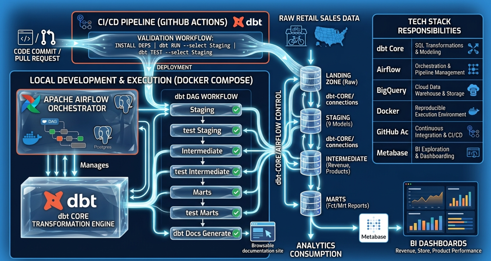

# Sales Analytics dbt Project

[](https://www.getdbt.com/)
[](https://cloud.google.com/bigquery)
[](https://airflow.apache.org/)
[](https://www.docker.com/)
[](https://github.com/d-rehoune/sales-analytics-dbt-project/actions)

End-to-end analytics engineering project built with dbt Core, Apache Airflow, Docker, and BigQuery on retail sales data — from raw sources to staging, intermediate and marts models, with automated testing, documentation, orchestration, CI/CD, and a revenue-focused reporting layer for BI.

## Context

This project simulates the analytics needs of a small multi-store bike retailer operating three physical locations across the US. The company wants to move toward a data-driven approach to support its operations team, with the goal of optimizing sales performance and maximizing revenue.

As the Analytics Engineer on this project, the mission was to model the raw sales and inventory data into a clean, tested, documented, and BI-ready dbt project, while building a reproducible orchestration environment around it.

### Analysis axes

Three analysis axes were prioritized to directly support the revenue optimization goal:

1. **Overall sales performance** — revenue trends over time, average order value, and discount impact.
2. **Store performance** — revenue and order volume comparison across the three store locations.
3. **Product performance** — revenue and sales volume by product, category, and brand.

Additional axes — inventory management, staff performance, customer analysis, and order fulfillment — were identified but are out of scope for this first iteration.

## Architecture

The project combines **dbt Core**, **Apache Airflow**, **Docker Compose**, **BigQuery**, **GitHub Actions**, and **Metabase** into an end-to-end analytics engineering workflow.



The main responsibilities are:

| Component          | Responsibility                                                 |
| ------------------ | -------------------------------------------------------------- |
| **BigQuery**       | Cloud data warehouse and storage layer                         |
| **dbt Core**       | SQL transformations, data modeling, testing, and documentation |
| **Apache Airflow** | Pipeline orchestration and task dependency management          |
| **Docker Compose** | Reproducible local execution environment                       |
| **PostgreSQL**     | Airflow metadata database                                      |
| **GitHub Actions** | Continuous integration and automated validation                |
| **GitHub**         | Version control and collaboration                              |
| **Metabase**       | BI exploration and dashboarding                                |

The architecture deliberately separates transformation from orchestration:

* **dbt Core** is responsible for transforming and validating data.
* **Airflow** is responsible for orchestrating the execution order.
* **Docker Compose** provides a reproducible local runtime environment.
* **GitHub Actions** validates changes before they are merged.
* **BigQuery** provides the analytical warehouse.
* **Metabase** consumes the final BI-ready models.

### Pipeline overview

```text
                         GitHub
                            │
                            ▼
                    GitHub Actions
                       CI / Tests
                            │
                            │
              ┌─────────────┴─────────────┐
              │       Docker Compose      │
              │                           │
              │         Airflow           │
              │                           │
              │     Scheduler / DAG       │
              │            │              │
              │            ▼              │
              │         dbt Core          │
              └────────────┬──────────────┘
                           │
                           ▼
                       BigQuery
                           │
                  staging → intermediate
                           │
                           ▼
                         marts
                           │
                           ▼
                       Metabase
                           │
                           ▼
                    BI dashboards
```

## Tech stack

| Layer              | Tool                    |
| ------------------ | ----------------------- |
| Data warehouse     | Google BigQuery         |
| Transformation     | dbt Core                |
| Orchestration      | Apache Airflow          |
| Containerization   | Docker / Docker Compose |
| CI                 | GitHub Actions          |
| Version control    | Git / GitHub            |
| BI / Visualization | Metabase                |

## Getting started

### Prerequisites

The project requires:

* Git
* Docker Desktop / Docker Engine with Docker Compose
* A Google Cloud project with BigQuery enabled
* A BigQuery service account with the required permissions

### 1. Clone the repository

```bash
git clone https://github.com/d-rehoune/sales-analytics-dbt-project.git
cd sales-analytics-dbt-project
```

### 2. Configure BigQuery credentials

Place the BigQuery service account credentials in:

```text
secrets/
└── bigqueryKey.json
```

The credentials file is excluded from Git and must never be committed to the repository.

### 3. Start the stack

Build and start the Docker Compose environment:

```bash
docker compose up -d --build
```

Check the running services:

```bash
docker compose ps
```

### 4. Open Airflow

The Airflow interface is available locally at:

```text
http://localhost:8080
```

From the Airflow interface, the dbt pipeline DAG can be triggered manually.

### 5. Run the pipeline

The Airflow DAG orchestrates the complete dbt workflow:

```text
staging
   │
   ▼
test staging
   │
   ▼
intermediate
   │
   ▼
test intermediate
   │
   ▼
marts
   │
   ▼
test marts
   │
   ▼
dbt docs generate
```

A failed test stops the downstream part of the pipeline.

### 6. Stop the stack

```bash
docker compose down
```

To remove the containers and associated volumes:

```bash
docker compose down -v
```

## Data pipeline

The dbt project follows the standard layered analytics engineering approach:

**staging → intermediate → marts**

### dbt lineage

The dbt lineage graph shows how the raw source tables flow through the staging and intermediate layers before reaching the final BI-ready marts.


| Layer            | Models                                                                                     | Purpose                                                                                              |
| ---------------- | ------------------------------------------------------------------------------------------ | ---------------------------------------------------------------------------------------------------- |
| **Staging**      | `stg_localbike_database__*` (9 models)                                                     | 1:1 representation of source tables — renaming, type casting, and light cleaning. No business logic. |
| **Intermediate** | `int_localbike_database__order_items_revenue`, `int_localbike_database__products_enriched` | Reusable business logic such as revenue calculations and product enrichment.                         |
| **Marts**        | `fct_order_items`, `mrt_order_items_daily_report`                                          | Final, denormalized, BI-ready models.                                                                |

## Orchestration with Airflow

Apache Airflow orchestrates the dbt pipeline and controls the execution order of each layer.

The DAG is intentionally structured so that each transformation layer is validated before the next layer is built.

### DAG workflow

```text
Start
  │
  ▼
dbt run --select staging
  │
  ▼
dbt test --select staging
  │
  ▼
dbt run --select intermediate
  │
  ▼
dbt test --select intermediate
  │
  ▼
dbt run --select marts
  │
  ▼
dbt test --select marts
  │
  ▼
dbt docs generate
  │
  ▼
End
```

This design provides several benefits:

* failures are detected as early as possible;
* downstream models are not built on top of invalid upstream data;
* each dbt layer has an explicit responsibility;
* Airflow makes dependencies and execution order visible;
* the same dbt project can still be executed independently of Airflow during development.

### Docker Compose environment

Airflow runs inside Docker Compose alongside the other orchestration services.

| Service                          | Purpose                              |
| -------------------------------- | ------------------------------------ |
| `airflow-webserver` / API server | Airflow UI and API                   |
| `airflow-scheduler`              | Schedules and orchestrates DAG tasks |
| `airflow-dag-processor`          | Processes DAG definitions            |
| `postgres`                       | Airflow metadata database            |

The dbt project and Airflow DAGs are mounted into the containers, allowing the local project structure to be used directly by the orchestration environment.

## dbt project structure

The dbt project is organized according to the following structure:

```text
models/
├── staging/
│   └── localbike_database/
│
├── intermediate/
│
└── marts/
```

The project also separates source definitions, tests, macros, documentation, and configuration according to dbt conventions.

## Models

### Staging

| Model                                 | Description                                                       |
| ------------------------------------- | ----------------------------------------------------------------- |
| `stg_localbike_database__brands`      | Bike brands.                                                      |
| `stg_localbike_database__categories`  | Product categories.                                               |
| `stg_localbike_database__customers`   | Customer master data.                                             |
| `stg_localbike_database__orders`      | Customer orders including status, dates, store, and staff.        |
| `stg_localbike_database__order_items` | Order line items, including a surrogate key.                      |
| `stg_localbike_database__products`    | Product catalog including price, model year, brand, and category. |
| `stg_localbike_database__staffs`      | Employee data, including manager hierarchy.                       |
| `stg_localbike_database__stocks`      | Inventory levels per store/product, including a surrogate key.    |
| `stg_localbike_database__stores`      | Store locations.                                                  |

Staging models remain close to the raw source structure and focus on:

* renaming columns;
* standardizing data types;
* light cleaning;
* creating technical keys when required.

Business logic is intentionally kept out of this layer.

### Intermediate

| Model                                         | Description                                                                                                                          |
| --------------------------------------------- | ------------------------------------------------------------------------------------------------------------------------------------ |
| `int_localbike_database__order_items_revenue` | Order items enriched with order-level attributes and revenue calculations including gross revenue, net revenue, and discount amount. |
| `int_localbike_database__products_enriched`   | Products enriched with brand and category names.                                                                                     |

Intermediate models contain reusable business logic shared by downstream marts.

### Marts

| Model                          | Grain                       | Description                                                                                                         |
| ------------------------------ | --------------------------- | ------------------------------------------------------------------------------------------------------------------- |
| `fct_order_items`              | One row per order line item | Fact table combining revenue, product, and store details. Main model for self-service BI exploration.               |
| `mrt_order_items_daily_report` | One row per day             | Daily aggregated revenue report including gross/net revenue, discount, units sold, orders, and average order value. |

## Design choices

### Monetary precision

All monetary fields such as `list_price` and `discount` are explicitly cast to `NUMERIC` rather than relying on BigQuery's automatically detected `FLOAT64`.

This avoids floating-point precision issues when calculating revenue and financial metrics.

### Surrogate keys

Order line items use a surrogate key:

```text
order_item_id = order_id + item_id
```

The source table does not provide a single-column primary key, so the composite business key is converted into a stable technical identifier.

The same approach is used where necessary for inventory records.

### BI-oriented denormalization

`fct_order_items` intentionally denormalizes store and product attributes instead of exposing separate dimension tables.

The objective is to provide a simple self-service BI model where analysts can explore revenue, products, stores, and orders without repeatedly joining multiple dimension tables.

### Pre-aggregated reporting model

`mrt_order_items_daily_report` pre-aggregates key metrics at the daily grain.

This keeps dashboard queries lightweight while providing the main metrics required for trend analysis.

## Testing & data quality

Data quality is treated as part of the transformation pipeline rather than as a separate validation step.

The dbt project includes model- and column-level tests such as:

* `not_null` and `unique` tests on primary and surrogate keys;
* `relationships` tests to enforce referential integrity between models;
* `accepted_values` tests on categorical fields such as `order_status` and `active`.

The Airflow DAG executes tests immediately after each transformation layer:

```text
staging → test → intermediate → test → marts → test
```

If a test fails, downstream tasks are not executed.

For local development, dbt can also be run directly:

```bash
dbt build --profiles-dir ./.dbt_profiles
```

or:

```bash
dbt test --profiles-dir ./.dbt_profiles
```

## Documentation

dbt generates a browsable documentation site containing:

* model descriptions;
* column descriptions;
* tests;
* source definitions;
* model dependencies;
* lineage information.

Documentation is generated automatically at the end of the Airflow pipeline with:

```bash
dbt docs generate --profiles-dir ./.dbt_profiles
```

The generated documentation provides a complete view of the transformation layer, from raw sources to final marts.

The lineage graph is also available directly in the repository:


For local exploration, dbt documentation can be served with:

```bash
dbt docs serve \
  --profiles-dir ./.dbt_profiles \
  --host 0.0.0.0 \
  --port 8081
```

The documentation is then available at:

```text
http://localhost:8081
```

## CI/CD

GitHub Actions is used for continuous integration.

The current architecture runs **dbt Core directly** rather than relying on dbt Cloud for transformation or CI execution.

### How it works

1. A pull request is opened or updated against `main`.
2. GitHub Actions starts the CI workflow.
3. The workflow installs the required dbt Core dependencies.
4. Authentication credentials are provided securely through GitHub Actions secrets.
5. dbt dependencies are installed.
6. The project is compiled and validated.
7. dbt tests are executed.
8. The workflow fails if compilation or data quality tests fail.

This ensures that changes are validated before being merged into the main branch.

### Why dbt Core in GitHub Actions?

Running dbt Core directly in GitHub Actions provides a consistent execution model between local development, orchestration, and CI.

It also:

* removes the dependency on dbt Cloud for CI execution;
* keeps the project portable;
* avoids duplicating transformation logic;
* validates the same dbt project that is orchestrated by Airflow.

### Secrets

Credentials are never committed to the repository.

Local development uses a BigQuery service account credential stored outside version control.

GitHub Actions uses repository secrets for CI authentication.

Sensitive credentials are therefore kept outside the source code and injected only at runtime.

## Dashboard

A two-page Metabase dashboard was built on top of `fct_order_items` and `mrt_order_items_daily_report`, covering the three main analysis axes.

### Overall sales performance

The first dashboard page provides an overview of the retailer's overall sales performance, with a focus on revenue, discounts, order volume, units sold, and revenue trends over time.


Key observations:

* **Total revenue**: $7.7M, with $889.9k in discounts applied across 1,615 orders and 7,078 units sold.
* Monthly gross vs. net revenue trend, showing the impact of discounts over time.
* Average net revenue per order, trending upward over the period.

> **Note:** the dataset is effectively concentrated between January 2016 and April 2018 — later months contain only a handful of residual orders, which explains the sharp drop visible at the end of the trend charts. This is a data coverage artifact, not an actual business decline.

### Store performance

The second dashboard page compares the three retail locations in terms of revenue, order volume, and average order value.


Key observations:

* **Baldwin Bikes** drives the majority of revenue (68%, $5.2M), well ahead of Santa Cruz Bikes (21%) and Rowlett Bikes (11%).
* Baldwin also has the highest order volume (1,093 orders), while average order value remains comparable across the three stores (~$4,600–$5,000).
* This suggests that the revenue gap is primarily driven by order volume rather than basket size.
* Order volume by store follows a similar seasonal pattern over time.

## Project evolution

The project initially started with dbt Cloud for development and execution.

As the architecture evolved, the transformation layer was migrated to **dbt Core** and integrated with an **Apache Airflow** orchestration environment running through **Docker Compose**.

The final architecture makes the responsibilities of each component explicit:

```text
dbt Core
    │
    │ transformation + testing
    ▼
Airflow
    │
    │ orchestration
    ▼
Docker Compose
    │
    ▼
BigQuery
    │
    ▼
Metabase
```

The migration also removed the dependency on dbt Cloud for transformation and CI execution, allowing local development, orchestration, and continuous integration to rely on the same dbt Core project.

## Repository structure

A simplified view of the repository:

```text
.
├── .github/
│   └── workflows/
│       └── dbt_ci.yml
│
├── dags/
│   └── dbt_pipeline_dag.py
│
├── dbt/
│   ├── models/
│   │   ├── staging/
│   │   ├── intermediate/
│   │   └── marts/
│   ├── macros/
│   ├── tests/
│   ├── dbt_project.yml
│   └── ...
│
├── docs/
│   └── images/
│       ├── architecture.png
│       ├── lineage_graph.png
│       ├── dashboard_overview.png
│       └── dashboard_by_store.png
│
├── secrets/
│   └── bigqueryKey.json
│
├── docker-compose.yml
├── Dockerfile
├── .gitignore
└── README.md
```

> The exact repository structure may vary slightly depending on the Docker and Airflow configuration.

## Key takeaways

This project demonstrates an end-to-end analytics engineering workflow combining:

* **dbt Core** for modular SQL transformation and data quality;
* **Apache Airflow** for workflow orchestration;
* **Docker Compose** for a reproducible local environment;
* **BigQuery** as the cloud data warehouse;
* **GitHub Actions** for continuous integration;
* **Metabase** for business reporting and self-service analytics.

The final pipeline covers the complete path from raw transactional data to tested, documented, orchestrated, and BI-ready analytical models.
